# Triton Architecture

This document describes Triton's current architecture as implemented in this repository.
It is intentionally current-state oriented. Future RFC-complete QUIC and HTTP/3 goals are useful context, but deployment and support decisions should follow the supported runtime boundary below.

Current-state authority order:

1. [SUPPORTED.md](SUPPORTED.md)
2. This file
3. [CONFIG.md](CONFIG.md), [API.md](API.md), and [OPERATIONS.md](OPERATIONS.md)
4. Future-looking project notes under `.project/`

## Executive View

Triton is a single Go binary for HTTP/3 and QUIC-oriented diagnostics. The binary exposes four operator-facing workflows plus one lab workflow:

- `triton server`: HTTPS/TCP test server, optional real HTTP/3, optional dashboard
- `triton probe`: target inspection and structured result generation
- `triton bench`: protocol benchmarking across H1, H2, and H3
- `triton check`: reusable probe plus bench verification for profiles and CI
- `triton lab`: isolated experimental in-repo UDP H3 runtime

The supported HTTP/3 implementation uses `quic-go` through `internal/realh3`.
The in-repo `internal/quic` and `internal/h3` packages are lab-only protocol-building blocks.

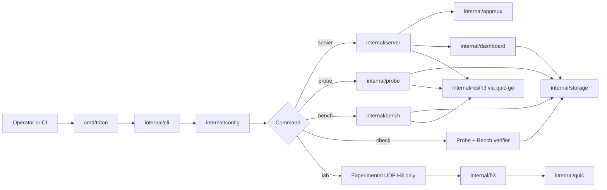

## Product Boundary

Triton has three transport planes in the repository, but only two are part of the supported production-like runtime.

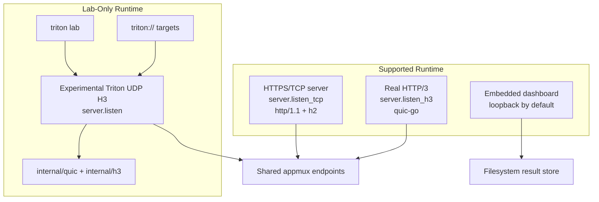

| Plane | Entry | Implementation | Status | Intended Use |
|---|---|---|---|---|
| HTTPS/TCP | `server.listen_tcp` | Go `net/http` with TLS | Supported | Normal server runtime, H1/H2 tests |
| Real HTTP/3 | `server.listen_h3`, `h3://`, H3 bench | `quic-go` through `internal/realh3` | Supported | Real HTTP/3 diagnostics |
| Dashboard | `server.dashboard` | Embedded static UI plus JSON API | Supported operator surface | Local or authenticated remote inspection |
| Triton UDP H3 | `server.listen`, `triton lab`, `triton://` | In-repo QUIC/H3 scaffold | Lab-only | Protocol research and loopback experiments |

## Repository Map

```text
.
|-- cmd/triton              CLI entrypoint and build-info wiring
|-- internal/cli            Command parsing, mode orchestration, output, reports
|-- internal/config         Defaults, YAML/env/flag layering, validation, profiles
|-- internal/server         Runtime listeners, TLS, dashboard startup, shutdown
|-- internal/appmux         Shared HTTP test endpoints, metrics, health/readiness
|-- internal/realh3         quic-go HTTP/3 client wiring
|-- internal/probe          Probe execution, fidelity metadata, analytics
|-- internal/bench          Benchmark workers, phase timing, protocol summaries
|-- internal/dashboard      Embedded UI, dashboard API, list/detail caches
|-- internal/storage        Filesystem gzip JSON persistence and summary indexes
|-- internal/observability  Request IDs, access logging, qlog trace integration
|-- internal/runid          Collision-safe probe and bench IDs
|-- internal/h3             Experimental minimal H3 frame/request dispatch
|-- internal/quic           Experimental QUIC packet/frame/stream/transport blocks
|-- scripts                 Local and CI helper scripts
|-- triton.yaml.example     Baseline configuration example
```

## Runtime Modes

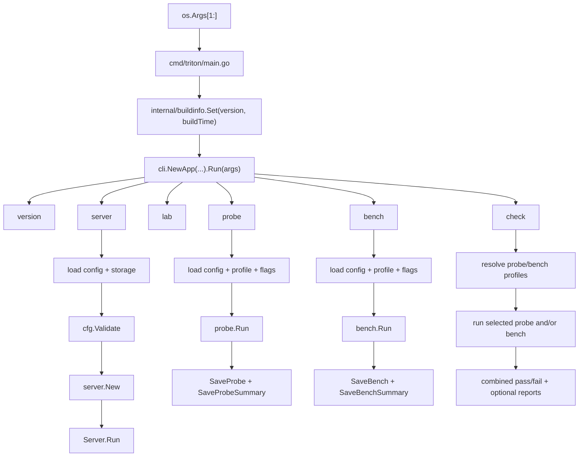

| Command | Primary Packages | Persistent Output | Notes |
|---|---|---|---|
| `server` | `internal/server`, `internal/appmux`, `internal/dashboard` | Runtime certs, traces, result reads | Long-running listener process |
| `lab` | `internal/server`, `internal/h3`, `internal/quic` | Optional traces/results through shared paths | Forces experimental listener, disables supported dashboard/TCP/H3 |
| `probe` | `internal/probe`, `internal/storage`, `internal/dashboard` summaries | Probe gzip JSON and summary JSON | Supports `https://`, `h3://`, and lab-only `triton://` |
| `bench` | `internal/bench`, `internal/storage`, `internal/dashboard` summaries | Bench gzip JSON and summary JSON | Supports H1/H2/H3 comparisons |
| `check` | `internal/cli`, `internal/probe`, `internal/bench` | Probe/bench results plus optional reports | Profile-based CI gate |

## Configuration Architecture

Configuration is merged in a strict, fail-fast order:

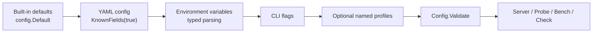

Important properties:

- Unknown YAML fields are rejected.
- Invalid typed environment variables fail startup.
- `probe.insecure` and `bench.insecure` require explicit `allow_insecure_tls`.
- `server.listen` is experimental and requires `allow_experimental_h3`.
- Non-loopback experimental binds require `allow_remote_experimental_h3`.
- Mixed real HTTP/3 plus experimental UDP H3 requires `allow_mixed_h3_planes`.
- Remote dashboard access requires `allow_remote_dashboard`, credentials, and explicit TLS files.

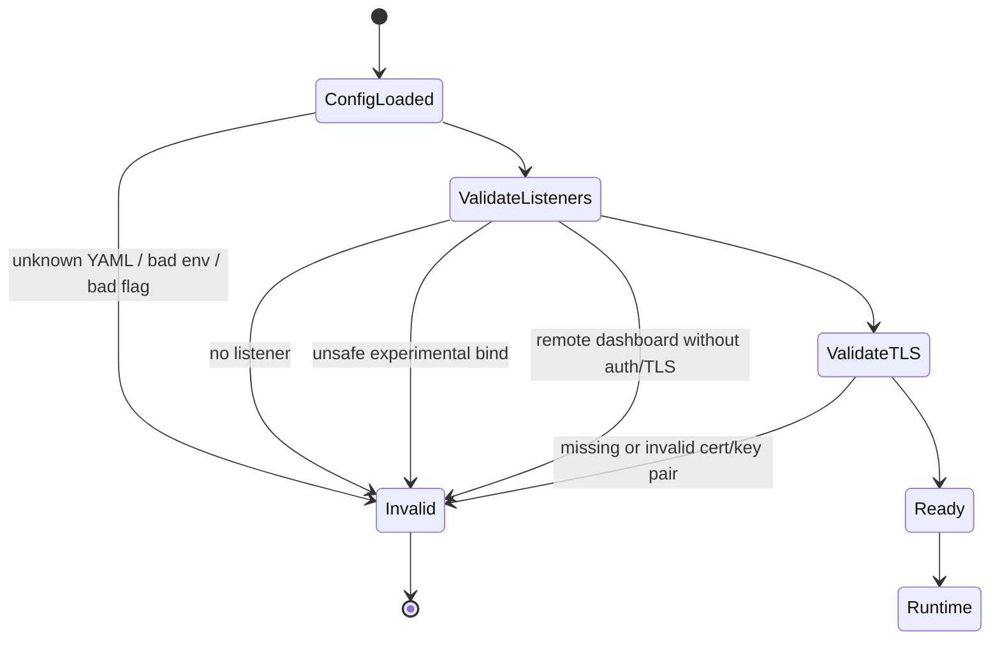

## Server Runtime

`internal/server.Server` owns process-level listener setup and shutdown. It builds one shared handler stack and attaches it to the active transport planes.

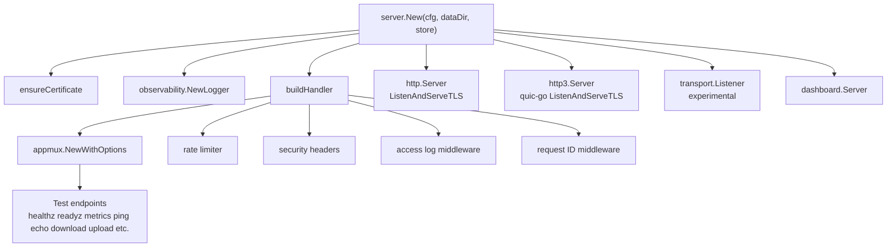

### Listener Matrix

| Config Field | Package Path | Protocol | Default | Safety Gate |
|---|---|---|---|---|
| `server.listen_tcp` | `net/http` in `internal/server` | HTTPS over TCP, H1/H2 | `:8443` | TLS material is generated or configured |
| `server.listen_h3` | `quic-go/http3` in `internal/server` | HTTP/3 over QUIC | empty | Supported, explicit listener opt-in |
| `server.listen` | `internal/quic/transport` + `internal/h3` | Experimental Triton UDP H3 | empty | Requires experimental opt-in |
| `server.dashboard_listen` | `internal/dashboard` | HTTP loopback or HTTPS remote | `127.0.0.1:9090` | Remote requires auth and explicit TLS |

### Shared Endpoint Layer

`internal/appmux` exposes a protocol-neutral `http.Handler`. The same handler can run behind HTTPS/TCP, real HTTP/3, and experimental UDP H3.

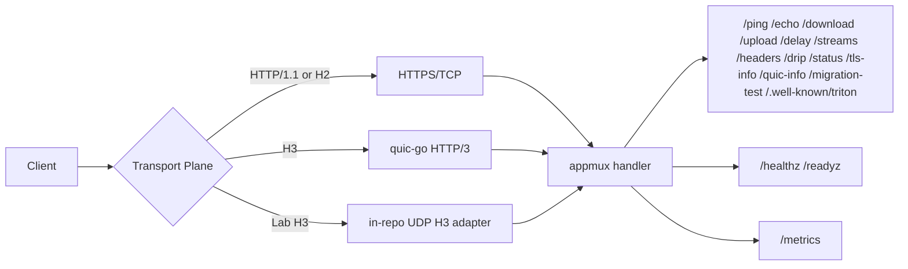

The appmux layer also provides:

- Route-level method checks
- Request body size limits
- Synthetic endpoint behavior for latency, throughput, redirects, headers, and stream-style sampling
- Prometheus-style counters from `/metrics`
- Capability discovery through `/.well-known/triton`
- Health/readiness hooks provided by `internal/server`

## Probe Architecture

`internal/probe` produces a structured `probe.Result` with timing, TLS metadata, headers, analysis sections, trace files, support metadata, and fidelity metadata.

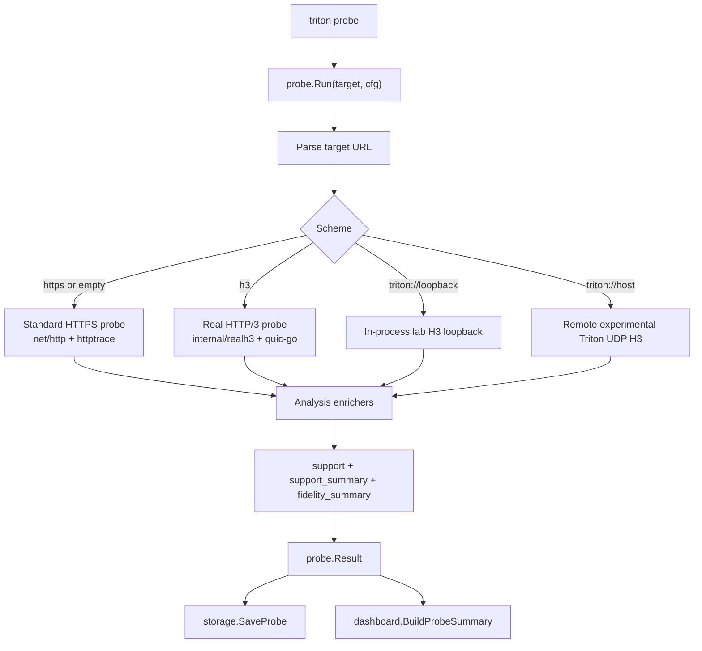

### Probe Fidelity Model

Probe output intentionally distinguishes direct diagnostics from approximations.

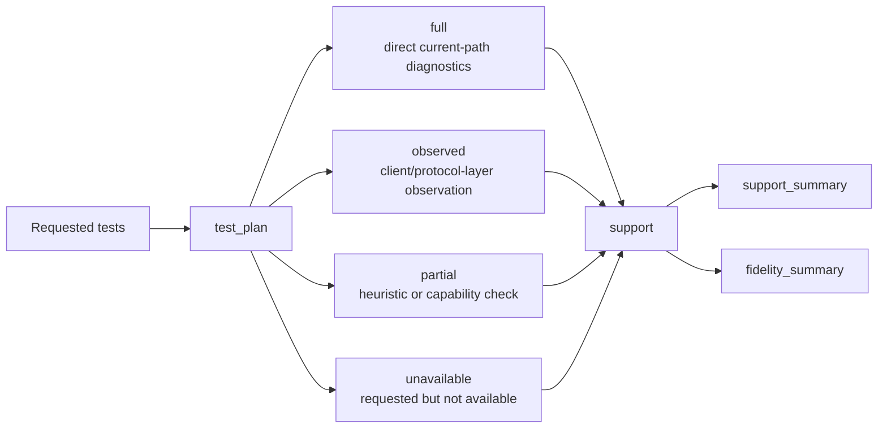

| Fidelity | Tests | Meaning |
|---|---|---|
| `full` | `handshake`, `tls`, `latency`, `throughput`, `streams`, `alt-svc` | Directly implemented current-path diagnostics |
| `observed` | `version`, `retry`, `ecn` | Derived from visible client/protocol metadata, not packet capture |
| `partial` | `0rtt`, `migration`, `qpack`, `loss`, `congestion`, `spin-bit` | Heuristic, estimate-based, or endpoint-contract checks |

### Probe Result Shape

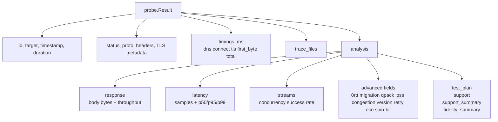

## Benchmark Architecture

`internal/bench` runs worker loops for configured protocols and returns per-protocol `Stats` plus an aggregate `Summary`.

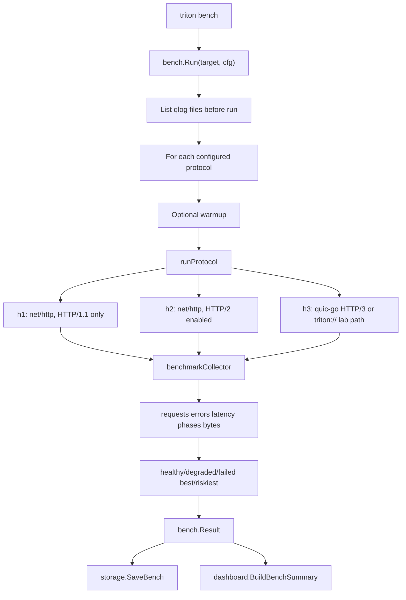

### Benchmark Worker Model

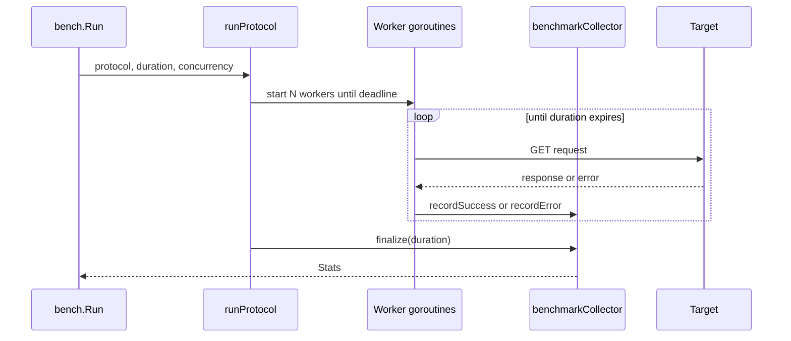

| Stat | Source |
|---|---|
| `requests`, `errors`, `error_rate` | Atomic worker counters |
| `avg_ms` | Successful request total duration |
| `req_per_sec` | Successful requests divided by configured duration |
| `latency_ms.p50/p95/p99` | Bounded sample set |
| `phases_ms.connect/tls/first_byte/transfer` | `httptrace` where available |
| `error_summary` | Categorized request failures |
| `summary.best_protocol` | Highest requests per second |
| `summary.riskiest_protocol` | Highest error rate |

## Check Architecture

`triton check` is a profile-oriented orchestration mode. It does not introduce a new measurement engine; it reuses probe and bench.

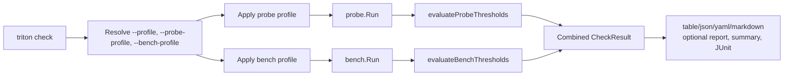

## Storage Architecture

`internal/storage.FileStore` is a local filesystem store for probe and bench results.

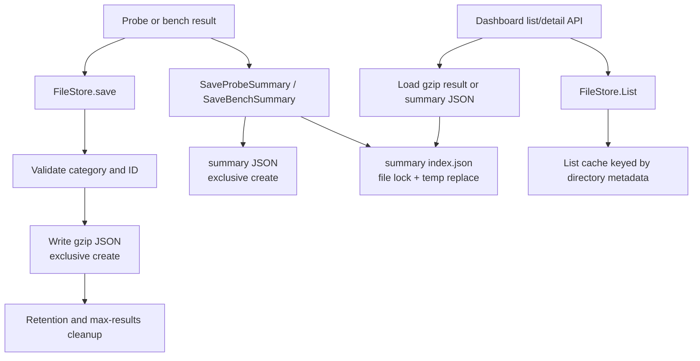

On disk, the default layout is:

```text
triton-data/
|-- probes/
|   `-- pr_*.json.gz
|-- benches/
|   `-- bn_*.json.gz
|-- probe_summaries/
|   |-- pr_*.json
|   `-- index.json
|-- bench_summaries/
|   |-- bn_*.json
|   `-- index.json
`-- certs/
    |-- server.crt
    `-- server.key
```

Storage design characteristics:

- Result IDs are validated before path construction.
- Result writes use exclusive creation and do not overwrite existing files.
- Full results are gzip JSON.
- Dashboard summaries are plain JSON for faster list rendering.
- Summary indexes are protected by an in-process write mutex plus lock files.
- Retention cleanup removes old or excess result files and matching summaries.

## Dashboard Architecture

The dashboard is an embedded operator UI plus a read-only JSON API.

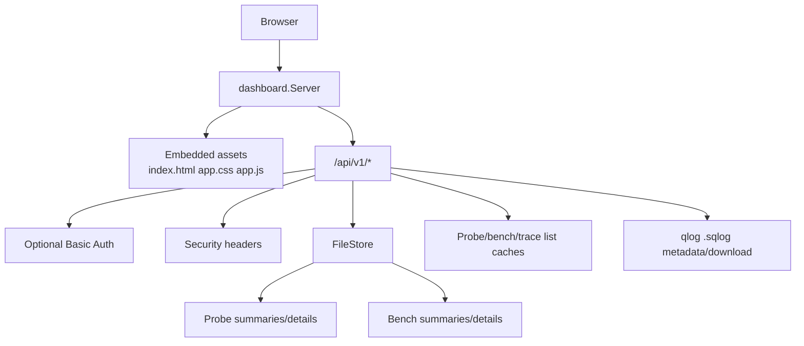

API surface:

| Route | Purpose |
|---|---|
| `GET /api/v1/status` | Dashboard uptime and storage counts |
| `GET /api/v1/config` | Sanitized dashboard-visible config snapshot |
| `GET /api/v1/probes` | Recent probe summaries with filter/sort/page support |
| `GET /api/v1/probes/:id` | Full stored probe result |
| `GET /api/v1/benches` | Recent bench summaries with filter/sort/page support |
| `GET /api/v1/benches/:id` | Full stored bench result |
| `GET /api/v1/traces` | qlog trace list |
| `GET /api/v1/traces/meta/:name` | qlog trace metadata and preview |
| `GET /api/v1/traces/:name` | qlog trace download |

Dashboard security posture:

- GET-only API routes
- Optional Basic Auth
- Remote dashboard mode requires auth and explicit TLS files
- Restrictive browser security headers
- API errors avoid exposing internal error detail
- Trace downloads validate `.sqlog` basenames and reject symlinks

## Observability Architecture

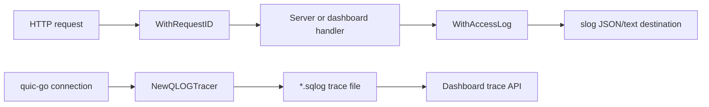

Observability components:

- Request IDs through `X-Request-Id`
- Access logs with component, method, path, status, bytes, duration, remote address, and user agent
- Startup logs that identify stable and experimental listener planes
- Prometheus-style appmux metrics from `/metrics`
- qlog trace generation for `quic-go` client/server paths when trace directories are configured
- Dashboard trace listing, preview, and download

## Real HTTP/3 Path

The supported HTTP/3 path is deliberately narrow and outsourced to `quic-go`.

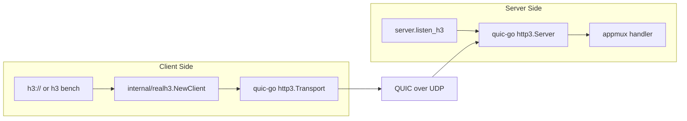

`internal/realh3` is intentionally small:

- It builds a `quic-go/http3.Transport`.
- It enforces TLS 1.3 for HTTP/3 clients.
- It attaches qlog tracing when configured.
- It supports a TLS session cache for resumption checks.

## Experimental QUIC/H3 Path

The in-repo transport path is useful for learning, tests, and lab experiments. It is not the production HTTP/3 engine.

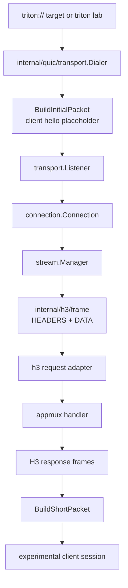

Implemented building blocks include:

- QUIC varint helpers
- Packet number helpers
- Long and short packet parsing/building
- Selected QUIC frame parsing/serialization
- UDP transport wrapper with pooled buffers
- Listener/dialer session scaffold
- Connection state transitions and frame dispatch
- Stream manager and reassembly behavior
- Minimal H3 `HEADERS` and `DATA` frames
- Handler dispatch from H3 requests into `http.Handler`

Current limitations:

- No RFC-complete TLS 1.3 QUIC handshake
- No packet-level production telemetry
- No production congestion control or recovery model
- No complete QPACK implementation
- No production-grade migration, Retry, ECN, or spin-bit validation

## Security Model

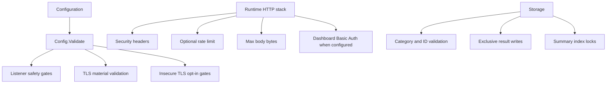

Key safety decisions:

- Experimental listeners are off by default.
- Lab-only remote exposure requires explicit opt-in.
- Remote dashboard mode requires auth and explicit certificate/key files.
- Runtime-generated certificates are not accepted for remote dashboard mode.
- Insecure client TLS must be acknowledged through `allow_insecure_tls`.
- Storage paths are constrained to known categories and validated IDs.
- Dashboard trace file access is limited to plain `.sqlog` basenames.

## Health, Readiness, and Metrics

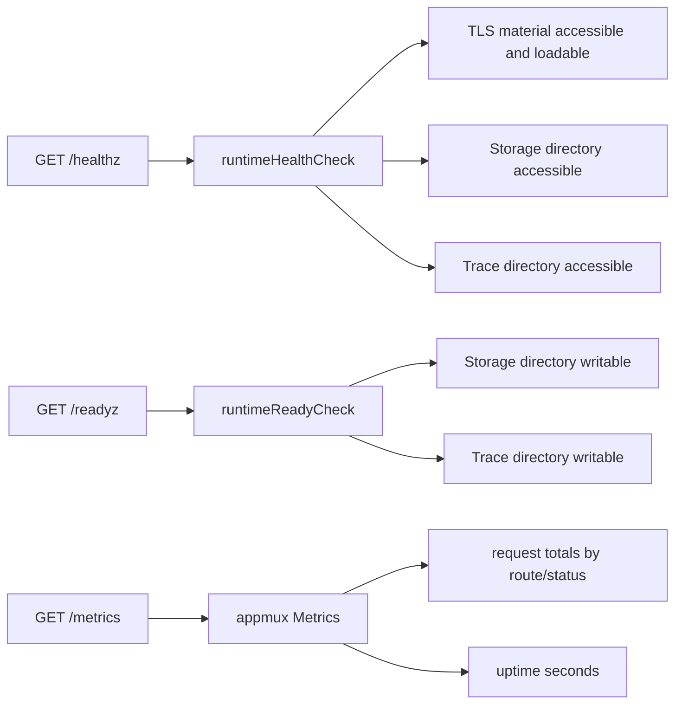

## Data Lifecycle

```mermaid
sequenceDiagram
    participant CLI as CLI command
    participant Engine as Probe/Bench engine
    participant Store as FileStore
    participant Summary as Dashboard summary builder
    participant Dash as Dashboard API
    participant UI as Browser

    CLI->>Engine: run target with merged config
    Engine-->>CLI: Result with timings, stats, analysis
    CLI->>Store: Save full gzip JSON
    CLI->>Summary: Build compact summary
    Summary-->>CLI: Summary JSON shape
    CLI->>Store: Save summary + update index
    UI->>Dash: GET /api/v1/probes or /benches
    Dash->>Store: List + load summaries
    Store-->>Dash: Summary list
    Dash-->>UI: JSON cards/tables
    UI->>Dash: GET detail by ID
    Dash->>Store: Load full gzip JSON
    Store-->>Dash: Full result
    Dash-->>UI: Detail JSON
```

## Dependency Direction

Triton's internal packages mostly follow a simple dependency shape: CLI orchestrates, engines measure, storage persists, dashboard reads, and shared transport/application primitives sit below them.

```mermaid
flowchart BT
    QUIC["internal/quic"] --> H3["internal/h3"]
    AppMux["internal/appmux"] --> Server["internal/server"]
    AppMux --> H3
    RealH3["internal/realh3"] --> Server
    RealH3 --> Probe["internal/probe"]
    RealH3 --> Bench["internal/bench"]
    Storage["internal/storage"] --> CLI["internal/cli"]
    Storage --> Dashboard["internal/dashboard"]
    Probe --> CLI
    Bench --> CLI
    Dashboard --> Server
    Config["internal/config"] --> CLI
    Config --> Server
    Observability["internal/observability"] --> Server
    Observability --> Dashboard
    Observability --> RealH3
    RunID["internal/runid"] --> Probe
    RunID --> Bench
```

Read the arrows as "is used by" from lower-level packages to higher-level packages.

## Testing and Quality Gates

The repository includes tests across:

- CLI command behavior and output
- Config loading, validation, profiles, and strict parsing
- Server endpoints, rate limiting, and runtime safety
- Probe analytics and remote paths
- Benchmark summaries and statistics
- Storage persistence, duplicate protection, and concurrent summary writes
- Dashboard API list/detail behavior
- QUIC packet, frame, wire, connection, stream, and transport helpers
- H3 frame parsing and loopback behavior

```mermaid
flowchart LR
    Unit["go test ./..."] --> Packages["internal packages"]
    Race["go test -race ./... in CI"] --> Packages
    Vet["go vet ./..."] --> Static["static correctness"]
    Staticcheck["staticcheck ./..."] --> Static
    Gosec["gosec ./..."] --> Security["security scan"]
    Smoke["scripts/ci-smoke"] --> CLI["binary smoke paths"]
    BenchGuard["scripts/ci-bench-guard"] --> Perf["benchmark guardrails"]
```

## Operational Profiles

### Local Development

```mermaid
flowchart LR
    Dev["Developer"] --> Server["triton server"]
    Server --> HTTPS["https://localhost:8443"]
    Server --> Dashboard["http://127.0.0.1:9090"]
    Probe["triton probe --target https://localhost:8443/ping --insecure --allow-insecure-tls"] --> HTTPS
```

Typical properties:

- Runtime-generated certificate material is acceptable for disposable local use.
- Dashboard stays on loopback.
- Storage defaults to `./triton-data`.
- Experimental transport remains disabled unless explicitly tested.

### Supported Production-Like Runtime

```mermaid
flowchart LR
    Operator["Operator"] --> Config["Explicit config"]
    Config --> Certs["server.cert + server.key"]
    Config --> HTTPS["server.listen_tcp"]
    Config --> H3["optional server.listen_h3"]
    Config --> Dash["dashboard loopback or authenticated HTTPS remote"]
    Config --> Store["persistent storage.results_dir"]
    HTTPS --> Health["/healthz /readyz /metrics"]
    H3 --> Health
    Dash --> API["/api/v1/status"]
```

Recommended posture:

- Use supported listeners only.
- Provide explicit TLS files for shared or remote environments.
- Keep dashboard loopback unless remote access is intentional.
- Mount persistent storage.
- Set retention and max-result limits.
- Monitor health, readiness, metrics, and dashboard status.
- Keep experimental flags unset.

### Lab Runtime

```mermaid
flowchart LR
    Research["Researcher"] --> Lab["triton lab"]
    Lab --> UDP["127.0.0.1:4433 by default"]
    UDP --> InRepo["internal/quic + internal/h3"]
    Probe["triton probe --target triton://loopback/ping"] --> UDP
```

Lab posture:

- Use for protocol experiments and educational inspection.
- Prefer loopback.
- Do not describe results as production HTTP/3 truth.
- Separate lab observations from supported-path operational claims.

## Known Limits

- Advanced probe fields are not all packet-level telemetry.
- The dashboard is a lightweight operator surface, not a full live protocol workbench.
- Persistence is filesystem-backed and single-node oriented.
- High-scale multi-tenant operation is not claimed.
- The in-repo QUIC/H3 implementation is research code.
- The supported HTTP/3 path depends on `quic-go` rather than the custom engine.

## Architecture Decision Summary

| Decision | Current Choice | Why |
|---|---|---|
| Product shape | Single binary | Simple local/CI/operator workflow |
| Supported H3 engine | `quic-go` | Real, maintained HTTP/3 behavior today |
| Custom QUIC/H3 | Lab-only in-repo scaffold | Useful for research without overstating support |
| Persistence | Filesystem gzip JSON plus summary indexes | Simple, inspectable, portable single-node storage |
| Dashboard | Embedded static assets plus read-only JSON API | No external frontend deployment required |
| Config | Defaults + YAML + env + flags | Works for local, container, and CI usage |
| Safety | Explicit opt-ins for risky modes | Avoid accidental remote/lab exposure |
| Fidelity | `full` / `observed` / `partial` metadata | Honest interpretation of probe output |
